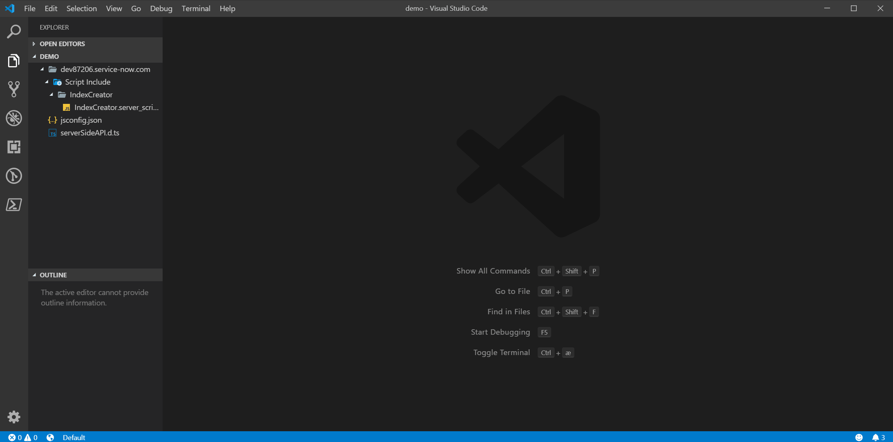
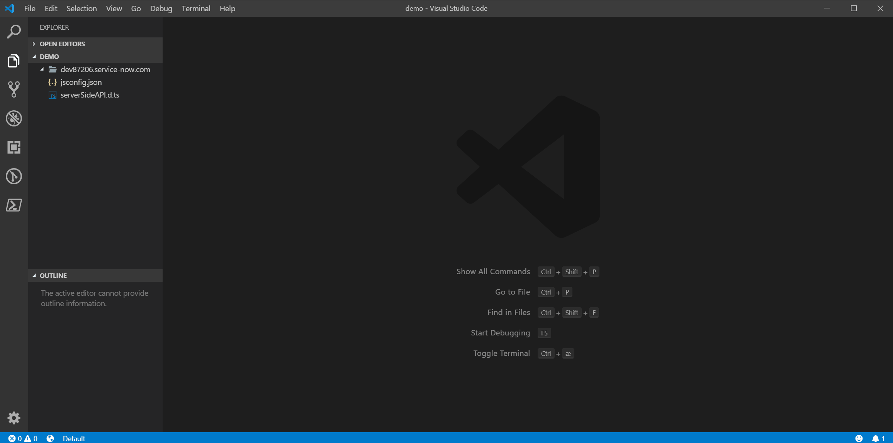

# CodeNow
Empower your ServiceNow Development with no instance configuration.

Write high quality code fast and intuitively.

## Feedback
Encounter an issue, got a question, or just general feedback raise an issue on github.

## To Short Want more
Check out our [Wiki](https://github.com/Syspeople/CodeNow/wiki) on github.

Here you find information regarding:
* Supported records.
* API's that currently have intellisense.
* Options and Commands.

## Create records
Create and develop many different kinds of pro code record types directly from Vs Code. 

## Open Records
Open existing Records.

## Intellisense and Snippets
Comprehensive intellisense and snippets for ServiceNow API's and widgets.

## Create and change Update sets
Create and change update sets directly from code

## Quick Access to Platform
Fast access to records in the ServiceNow platform.

